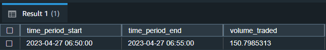

# Cryptocurrency Data Pipeline with Docker Compose, PostgreSQL, Airflow, Terraform, AWS S3, AWS Redshift, and AWS Quicksight.

## Overview

The goal of this project is to create an orchestrated ETL pipeline moving `Open, High, Low, Close, and Volume` [(ohlcv)](https://docs.coinapi.io/market-data/rest-api/ohlcv) data to cloud storage for analytics/business intelligence. This is done by using a local Airflow instance running in a docker-compose environment to orchestrate dags written in Python. These dags save data every 5 minutes to a local Postgres database, load csv files to S3 once a day, and then copies the csv file data into Redshift tables. Lastly the data is visualized in an AWS quicksight dashboard.

## Technologies being used:

* Cloud: AWS
* Containerization: Docker
* Infrastructure: Terraform
* Orchestration: Airflow
* Data lake: S3
* Data warehouse: Redshift
* Data visualization: Quicksight
* Local Database: PostgreSQL
* API: [CoinAPI](https://www.coinapi.io/)

## How the Pipeline Works

### Pipeline Flowchart

### Crypto Data Pipeline

1. Run `docker-compose up`.
2. The Airflow services and Postgres are ran in Docker containers.
3. Every 5 minutes the dag `crypto_prices_dag` reaches out to CoinAPI and extracts ohlcv data for bitcoin, ethereum, and ripple cryptocurrencies being traded on the Bitstamp exchange.
    * First 3 separate `PostgresOperator` create table tasks ensure that a table is created for each of the three coins data is being pulled for.
    * Next 3 `PythonOperator` tasks run extrating ohlcv data from the api, transforms the data by modifying the datatypes of several columns and adding an additional column, and lastly using a `PostgresHook` and a sqlalchemy engine to load the data into the local Postgres database.
        * A connection to the Postgres database was defined on the Airflow web ui that the `PostgresHook` uses to connect to the database.
4. @Daily the dag `crypto_prices_load_to_s3_redshift` is run which uses a `PythonOperator` to call a function which connects to the Postgres database using a PostgresHook and a sqlalchemy engine, save the data which matches the current execution date, save the data as a csv file, and upload these csv files to S3 using an `S3Hook`.
    * A connection to the S3 bucket created by Terraform was defined in the Airflow web ui by defining the AWS credentials as well as the region to use.
5. A `RedshiftDataOperator` is used to create each table if they do not exist.
    * A connection to the Redshift cluster created by Terraform was defined in the Airflow web ui by defining the host, database, user, password, and port to connect to.
6. Lastly, the `S3ToRedshiftOperator` is used to COPY the csv file information from S3 into Redshift using both S3 and Redshift connections.

`crypto_prices_dag` orchestrated every 5 minutes to load data into Postgres.

`crypto_prices_load_to_s3_redshift` dag orchestrated once daily to load data from Postgres to S3 and Redshift

### AWS Cloud Infrastructure

All of the cloud infrastructure was defined using Terraform.

1. Configure the AWS CLI using `aws --configure` in the command line.
2. Create the terraform infrastructure in the `main.tf` file.
    * `terraform init` to initialize the terraform configuration files in the working directory.
    * `terraform plan` to plan the infrastructure defined in the main file. Here you can preview the infrastructue that will be built/modified.
    * `terraform apply` and type `yes` to apply the infrastructure plan.
3. The infrastructure has been created and can be viewed on the AWS console home.
    * In my case this is an S3 bucket, a Redshift cluster, an IAM role with policies tthat allow Redshift to copy from S3, a default vpc, security group, and a vpc enpoint which allows us to establish the connection created in the Airflow web ui.
    * A `variables.tf` was created to save the credentials used to create the infrastructure, but was ignored in the `.gitignore` file.

## AWS Quicksight Dashboard example:

## AWS Redshift Query examples:

1. All raw data from the bitcoin prices table:

2. Highest volume trading period:

